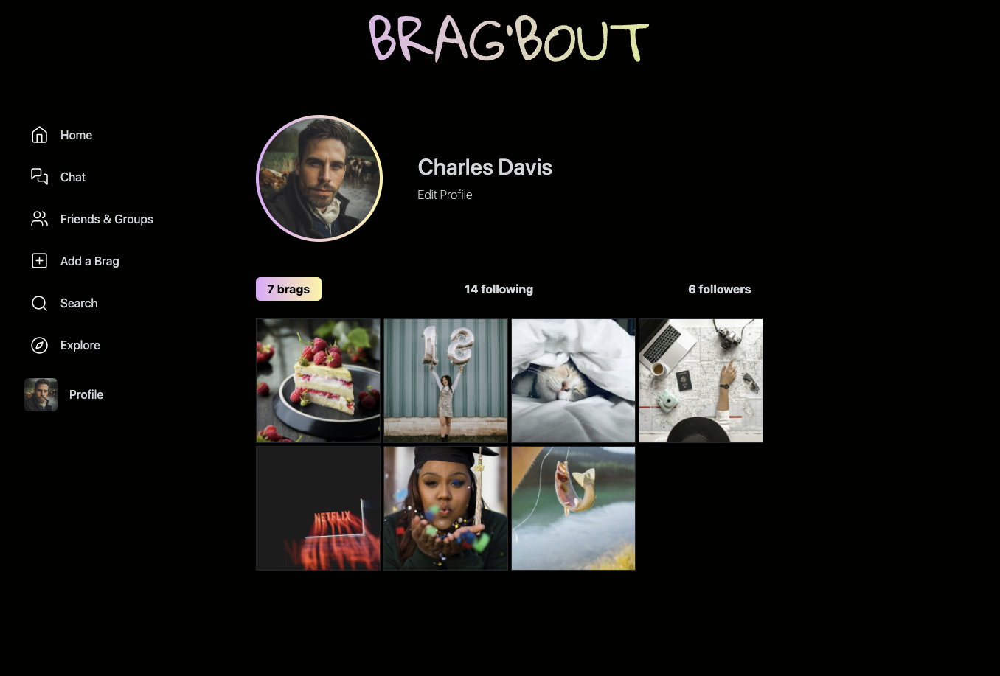

## Overview

Brag'bout is a social media platform that allows users to share their accomplishments and achievements with their friends and family. Users can create an account, post their accomplishments, and view other users' posts. Users can open friends post and start chating or celebrating together with other friends.

## Getting Started

1. **Installation:** Clone the repository and install dependencies using `npm install`.

2. **Use Live Server:** Use the Live Server extension in VS Code to run the application on your local machine.

## Tech Stack

- HTML
- BOOTSTRAP
- CSS
- SASS
- JAVASCRIPT
